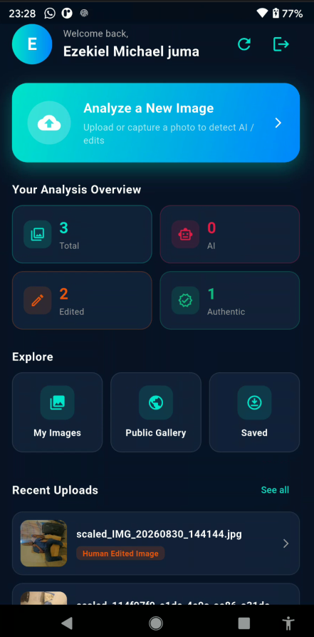
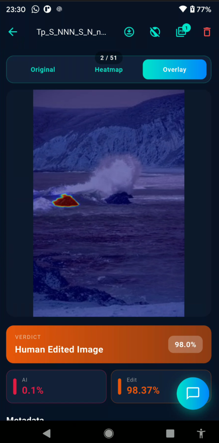
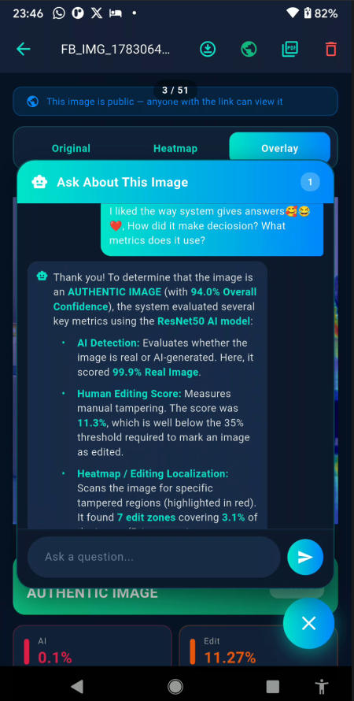

# img_auth

# Image Authentication Mobile App

A Flutter-based mobile application developed for image authentication and forensic analysis. The application allows users to submit images for analysis and communicates with a Django REST API backend to process the images and return authentication results.

This mobile application was developed as part of a Cyber Security and Digital Forensics Engineering project, focusing on identifying whether an image is **authentic, human-edited, or AI-generated**.

## 📱 Screenshots

### Login / Gmail Login


### Home page


### Authentication Result




### Chat Bot Explaining the answer


> More screenshots can be found in the `screenshots/` directory.

## ✨ Features

* 📷 Upload images for authentication
* 🔗 Communicates with a Django REST API backend
* 🔍 Image authentication and forensic analysis
* 🤖 AI-generated image detection
* ✏️ Human-edited image detection
* ✅ Authentic image identification
* 📊 Displays image authentication results
* 📱 Responsive Flutter mobile interface
* 🔐 Designed for cybersecurity and digital-forensics use cases

## 🏗️ System Architecture

The application uses a mobile-to-API architecture:

```text
┌─────────────────────┐
│   Flutter Mobile    │
│     Application     │
└──────────┬──────────┘
           │
           │ REST API
           ▼
┌─────────────────────┐
│    Django Backend   │
│      REST API       │
└──────────┬──────────┘
           │
           ▼
┌─────────────────────┐
│ Image Authentication│
│    & Analysis       │
└──────────┬──────────┘
           │
           ▼
┌─────────────────────┐
│ Authentication      │
│      Result         │
└─────────────────────┘
```

## 🛠️ Technologies Used

### Mobile Application

* Flutter
* Dart

### Backend

* Python
* Django
* Django REST Framework

### Image Authentication

* Image Forensics
* AI-generated Image Detection
* Human Edit Detection
* Image Metadata Analysis

### Development Tools

* Git
* GitHub
* Android Studio / VS Code

## 🔄 How It Works

1. User opens the Flutter mobile application.
2. User selects an image from the device.
3. The application sends the image to the Django REST API.
4. The backend processes the submitted image.
5. Image authentication and forensic analysis are performed.
6. The API returns the analysis result.
7. The Flutter application displays the authentication result to the user.

## 🚀 Getting Started

### Prerequisites

Make sure you have installed:

* Flutter SDK
* Dart SDK
* Android Studio or VS Code
* Git
* A running Django API backend

### Clone the Repository

```bash
git clone https://github.com/YOUR_USERNAME/YOUR_REPOSITORY.git
cd YOUR_REPOSITORY
```

### Install Dependencies

```bash
flutter pub get
```

### Configure the API

Update the API base URL in the application configuration/source code so that it points to your running Django backend.

For example:

```text
http://YOUR_SERVER_IP:8000/api/
```

Do not use `localhost` when testing the application from a physical Android device unless the backend is running on the device itself.

### Run the Application

Connect an Android device or start an Android emulator, then run:

```bash
flutter run
```

## 📂 Project Structure

```text
lib/
├── main.dart
├── models/
├── screens/
├── services/
├── widgets/
└── ...
```

The exact structure may vary depending on the current implementation.

## 🔗 Backend API

This mobile application communicates with a separate Django REST API backend responsible for processing image authentication requests.

**Backend Repository:**
`https://github.com/YOUR_USERNAME/YOUR_DJANGO_API_REPOSITORY`

## 🎯 Project Purpose

The project demonstrates the application of cybersecurity, digital forensics, artificial intelligence, mobile development, and REST API technologies in an image authentication system.

The system is intended to help determine whether a submitted image is:

* **Authentic / Real**
* **Human-edited**
* **AI-generated**

## 👨‍💻 Developer

**Ezekiel Michael Juma**

Cyber Security & Digital Forensics Engineering Graduate

* GitHub: https://github.com/EzekielMichael
* LinkedIn: https://www.linkedin.com/in/ezekiel-michael-93234a2bb
* Email: [ezekielmichaeljuma1st@gmail.com](mailto:ezekielmichaeljuma1st@gmail.com)

## 📄 License

This project is developed for educational, research, and portfolio purposes.

